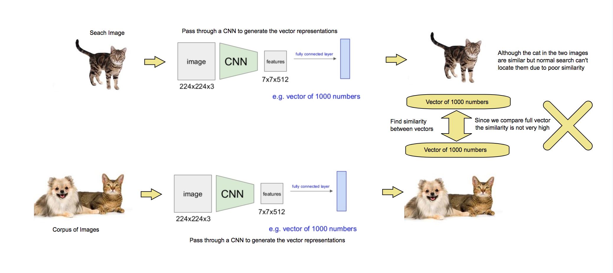
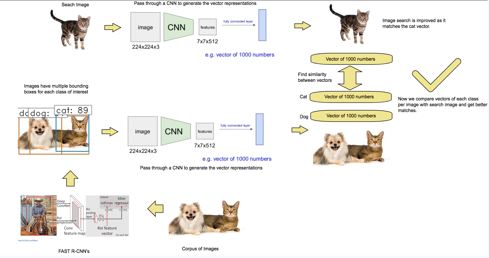

# imageSearch

Normal image search works as follows and it has issues finding similarity between images when there are multiple objects in an image.

## Improved Image Search

My idea is very simple as shown below. We first locate multiple objects of interest in the corpus of images and then draw bounding boxes around them. We then pass these bounding boxes through CNN's and get multiple vectors per image (1 per bounding box). This way when we compare vector for searched image we get better results

# Instructions

## Faster R-CNN Step

I used the Faster R-CNN implementation in keras as demonstarted by https://github.com/yhenon/keras-frcnn. Followed the instructions on frcnn github to train over PASCAL_VOC dataset. Then I modified the test file to output 
- Image Name
- Class Name
- Bounding Box ( X1, Y1 ) and ( X2, Y2 )

All my image corpus is passed through the modified test_frcnn.py to get a csv file containing the above data.
> test_frcnn.py 

Generates img_regions_cats.csv

class,image_name,x1,x2,y1,y2  
cat,Cat_001.jpg,50,155,20,180  
cat,Cat_002.jpg,9,219,-10,224  
cat,Cat_003.jpg,68,185,29,185  
cat,Cat_003.jpg,112,175,39,180  
cat,Cat_004.jpg,67,222,20,196  

## CNN to vector step

Then I read the csv file and pick up the file and crop it the dimensions of bounding box and pass it through an resnet50 CNN. Then I store each image with its vector representation and then store them as *.npy files in data folder.

> img_vecs.py

Generates the image vectors for entire corpus and store it as a *.npy

## Search Image

My image search takes the query image and matches its image vector with the vectors loaded from *.npy file and gets top 5 closest images. It uses cosine similarity to measure the image similarity.

> search.py

Search's the query image and gets the closest matching 5 images.
